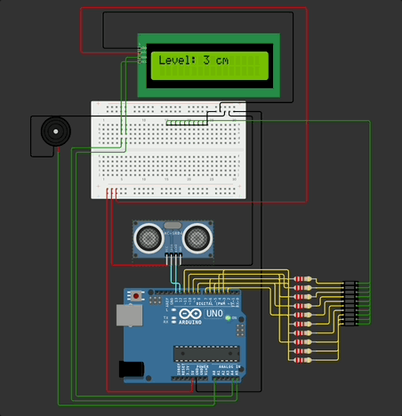
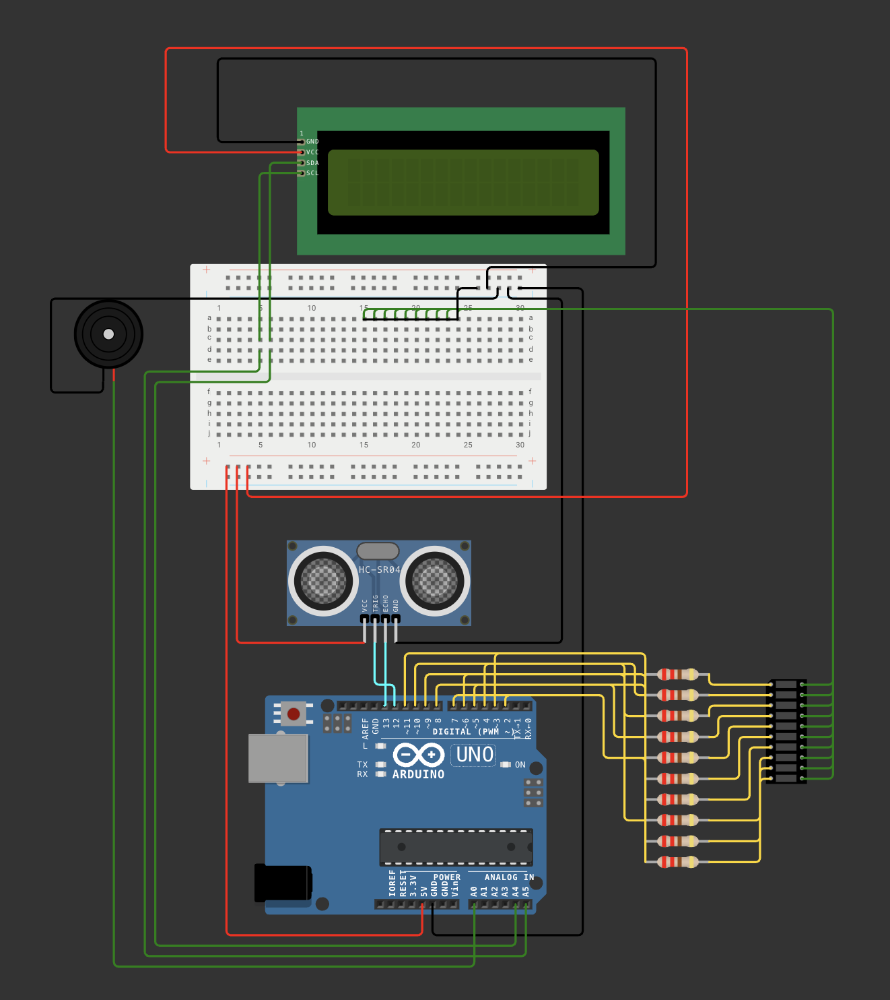

# 💧 Smart Water Level Indicator 🚰

This Arduino-based project monitors the water level in a tank using an **ultrasonic sensor (HC-SR04)** and displays the level on an **I2C 16x2 LCD** in **centimeters**. It uses a **LED bar graph** to indicate water level visually and activates a **buzzer alert** when the tank is near full (within 4 cm). The tank height is configurable and currently set to **400 cm**.

---

## 🎬 Demo

---

## 🔧 Features

- 🧪 Accurate water level measurement using ultrasonic sensor
- 📟 16x2 LCD shows level in cm and progress bar
- 🔋 LED bar graph shows water fill level visually
- 🚨 Buzzer rings when water level is within 4 cm of full tank
- 📏 Customizable tank height (set to 400 cm)
- ⚡ Built on Arduino Uno

---

## 🧠 Components Used

| Component            | Quantity |
|----------------------|----------|
| Arduino Uno          | 1        |
| HC-SR04 Ultrasonic Sensor | 1    |
| I2C 16x2 LCD Display | 1        |
| 10-segment LED Bar Graph | 1     |
| Buzzer               | 1        |
| Breadboard & Wires   | As needed |
| Resistors (220Ω for LEDs) | 10     |

---

## 🔌 Circuit Diagram

 > 💡 Tip: You can simulate and test this project using [!Wokwi Arduino Simulator]([https://wokwi.com](https://wokwi.com/projects/433375135102663681))

---

## 🖥️ How It Works

1. The **HC-SR04** measures the distance between the sensor and the water surface.
2. Water level = `tank height - measured distance`.
3. LCD displays this level in **cm** and shows a **progress bar**.
4. LED bar graph lights up proportionally.
5. When the water level is **≥ 396 cm**, the buzzer rings.

---

## 🚀 Getting Started

### Upload the Code

1. Open `water_level_indicator.ino` in Arduino IDE.
2. Select your Arduino board and COM port.
3. Upload and power on the setup.

### Wiring Reference

- **Ultrasonic Sensor**
  - VCC → 5V
  - GND → GND
  - TRIG → Pin 9
  - ECHO → Pin 8
- **I2C LCD**
  - SDA → A4
  - SCL → A5
- **LED Bar Graph**
  - Connect 10 digital pins (e.g., 2 to 11) via 220Ω resistors.
- **Buzzer**
  - Positive (+) → Pin A0
  - Negative (–) → GND

---

## ✅ Future Improvements

- 🛜 Add IoT support (e.g., Blynk, ESP8266)
- 📱 Mobile app notification
- 🧠 Automatic pump control with relay

---

## 📜 License

MIT License – you are free to use, modify, and share this project.

---

**🌟 If you liked this project, don't forget to star the repo!**

---
