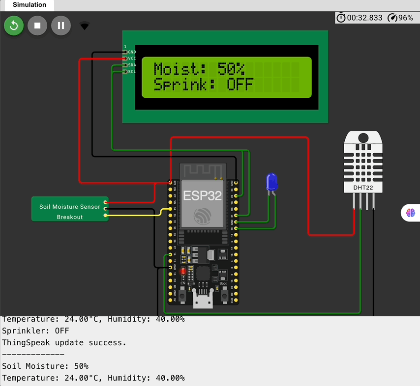
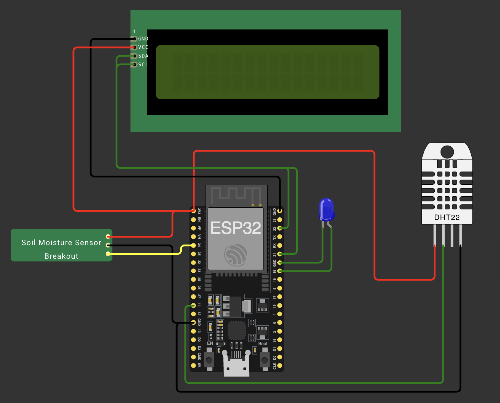
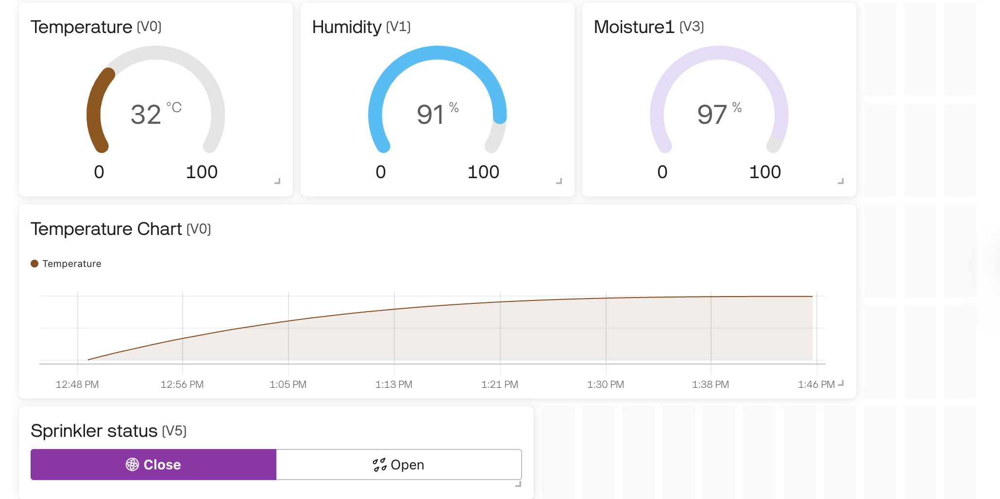

# IoT-Based Smart Agriculture Monitoring

## Problem Statement
Traditional agriculture practices often lack data-driven insights, leading to **inefficient irrigation** and **poor crop health**.

## Objective
Design a **smart agriculture system** that monitors:
- Soil moisture
- Temperature
- Humidity  
...and automatically activates a **sprinkler system** when moisture drops below a threshold. Data is transmitted to a **Blynk IoT dashboard** for real-time monitoring.

---

## Requirements
- NodeMCU ESP8266 / ESP32
- Soil Moisture Sensor
- DHT22 Temperature & Humidity Sensor
- 16x2 LCD Display with I2C module
- LED (used to indicate **sprinkler ON/OFF**)
- Blynk App (Web or Mobile)
- Breadboard, jumper wires
- WiFi access

---

## Demon GIF

---

## Circuit Components & Wiring (Simulated on Wokwi)

### Wokwi Components Used
- **ESP32 DevKit v1**
- **DHT22 Sensor**
- **Soil Moisture Sensor**
- **16x2 LCD (I2C)**
- **LED** → represents **sprinkler system**

---

### Circuit diagram used in Wokwi

---

### ⚡ Connections Summary

| Component         | ESP32 Pin |
|------------------|------------|
| DHT22 (DATA)     | GPIO 21    |
| Soil Moisture    | GPIO 34 (Analog) |
| I2C LCD (SDA)    | GPIO 23    |
| I2C LCD (SCL)    | GPIO 22    |
| LED (Sprinkler)  | GPIO 19    |

> Note: In real hardware, GPIO34 is analog input-only, and GPIO19 can be used as digital output to control relay or sprinkler.

---

## LCD Display Output
The 16x2 LCD displays:
- Soil Moisture in percentage
- Sprinkler Status: `ON` or `OFF`

---

## Sprinkler Logic
- Sprinkler turns **ON** if moisture < 15%
- Sprinkler turns **OFF** if moisture > 85%
- LED connected to GPIO19 shows current sprinkler status (ON = LED ON)

---

## Blynk IoT Dashboard

Even though **Wokwi cannot connect to the internet**, we designed a complete **Blynk Dashboard** for this project. This includes:

- Temperature Gauge (V0)
- Humidity Gauge (V1)
- Soil Moisture Gauge (V2)
- Sprinkler Status Label (V3)
- SuperCharts for monitoring over time

### Blynk Dashboard Screenshot
 

> In real-world deployment, these values would be updated in real-time via `Blynk.virtualWrite()` calls.

---

## Why Wokwi Instead of Blynk for Simulation?

- Wokwi **doesn't support real Wi-Fi or cloud connections**, so we can't actually send data to Blynk while simulating.
- However, **all sensor readings, threshold logic, and LCD interface are fully functional** in Wokwi.
- We simulate the **LED as a substitute for sprinkler relay** to visualize sprinkler control.

---

## Expected Outcome

> A smart agriculture prototype that:

- Automates irrigation via sprinkler system
- Displays sensor data on LCD
- Integrates with Blynk for remote monitoring (real hardware)
- Demonstrates logic and functionality on Wokwi simulator (offline)

---

## Conclusion
This system ensures that crops receive timely irrigation and farm conditions are continuously monitored. Even without hardware, Wokwi helps simulate logic and test code, and the Blynk dashboard completes the IoT functionality in deployment.

