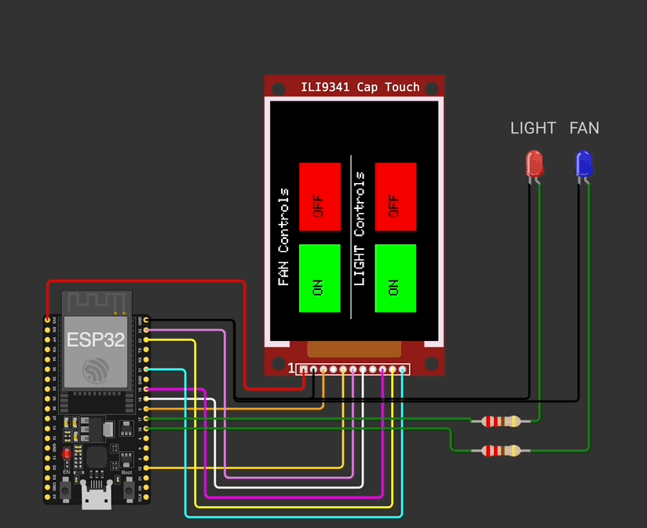
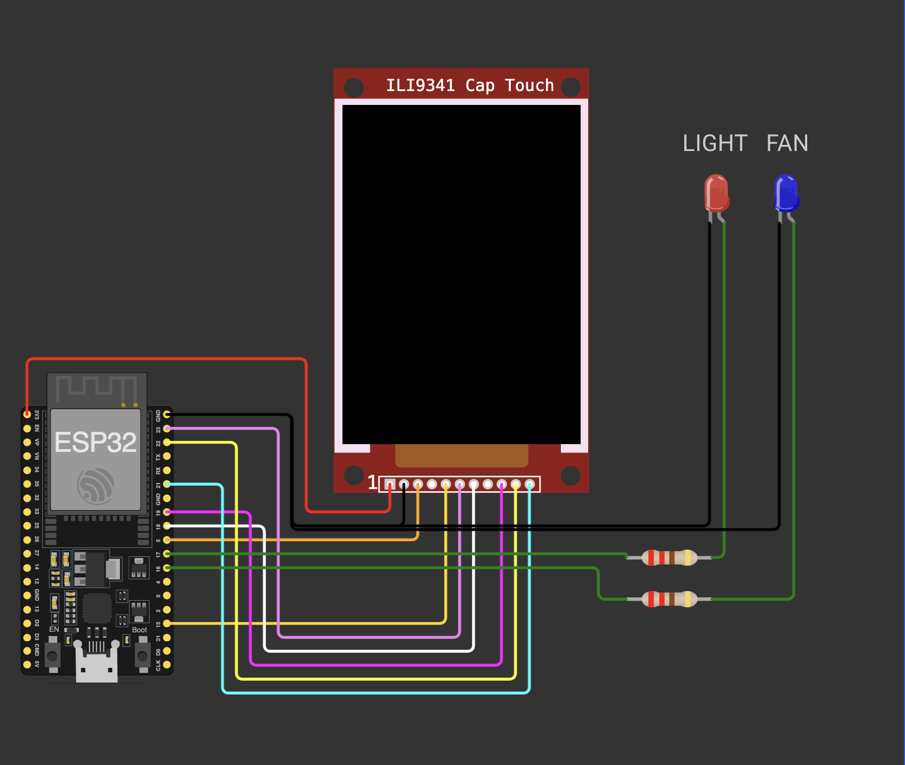
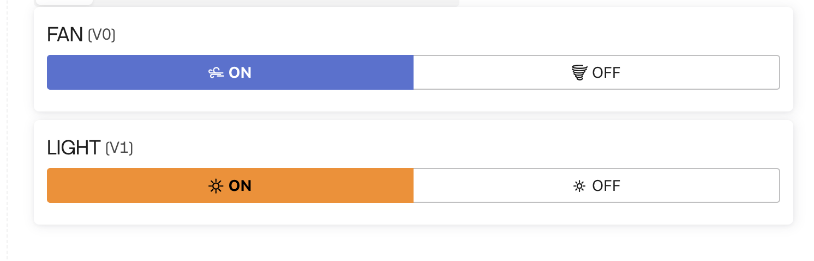

# 🏠 Smart Home Automation using ESP32 + Blynk + TFT Touch (Wokwi Simulated)

Control home appliances **remotely via Blynk app** and simulate their local control using a **TFT touch screen interface** in **Wokwi**.

This project demonstrates how **IoT and embedded systems** can work together to create a **realistic smart home control panel** that also functions in a **simulated environment** for learning and testing.

---

## 🎬 Demo

                    
  

---

## 🔌 Circuit Diagram

---

## Blynk Dashboard  

 

---

## 🚀 Project Overview

- 💡 Control **Light** and **Fan** appliances.
- 📲 Remotely turn ON/OFF appliances using **Blynk mobile app**.
- 🖥 Simulate physical control using **TFT touchscreen** in [Wokwi](https://wokwi.com).
- 🔁 Dual-mode: **Touch interface** for local control + **Blynk** for remote.

---

## 🧰 Components Used

| Component             | Details                         |
|-----------------------|----------------------------------|
| MCU                   | ESP32 DevKit V4                  |
| Display               | ILI9341 240x320 TFT              |
| Touch Controller      | FT6206 Capacitive Touch Sensor   |
| LEDs (Appliances)     | 2x LEDs (for Light & Fan)        |
| Platform              | Wokwi Simulator + Blynk App      |

---

## ⚙️ Working Principle

- 👆 **Touchscreen Simulation (Wokwi):**
  - Four buttons appear on TFT display: `Light ON/OFF`, `Fan ON/OFF`.
  - Touching a button sends digital signal to corresponding output pin.
  - Simulates appliance switching locally.

- 📱 **Blynk Remote Control (Real Scenario):**
  - Users can control Light and Fan via the Blynk mobile dashboard.
  - In real deployment, commands are received through internet using ESP32 WiFi.
  - ESP32 triggers GPIOs based on Blynk input to switch the appliances.

> For simulation in Wokwi, the Blynk part is **not active** due to no internet support.  
> But the interface and logic are structured to match actual IoT usage.

---

