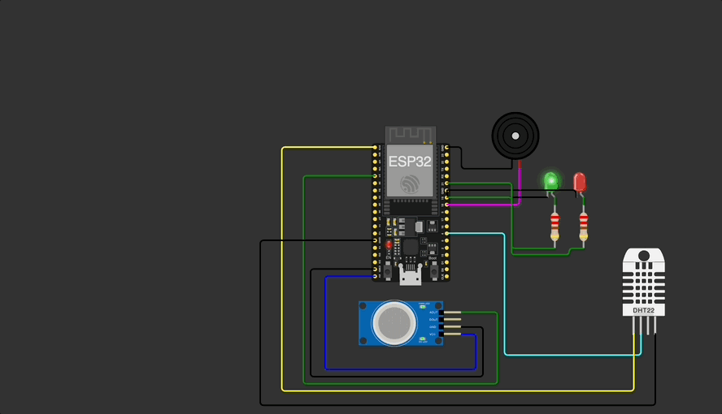
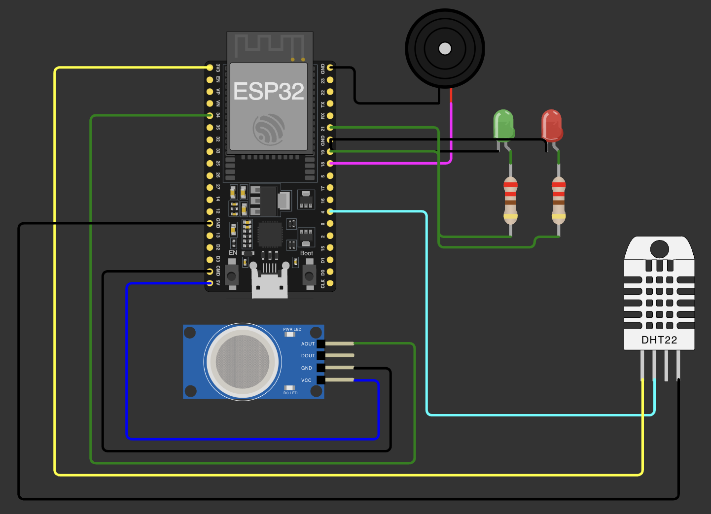
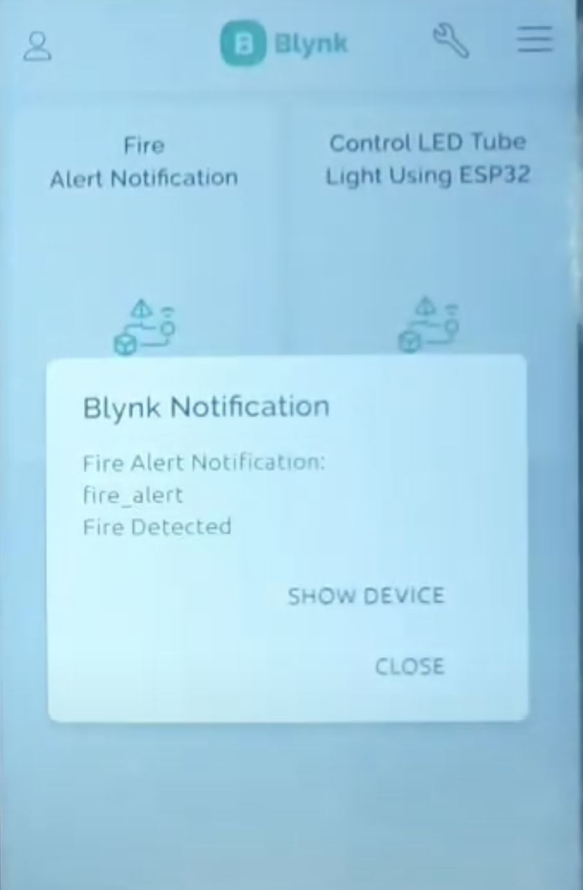

# IoT-Based Fire Detection System (ESP32 + DHT22 + MQ-2 + Blynk)

This project focuses on **real-time fire and gas detection** using an ESP32 board with **temperature and gas sensors**, and sends **instant push alerts to your mobile via Blynk IoT**.

---

## Project Demo GIF

  

---

## Features

-- Real-time temperature and gas monitoring  
-- Automatic detection of fire or smoke using **DHT22** and **MQ-2**  
-- Visual alerts using **LEDs** and **Buzzer**  
-- Sends mobile push notifications using **Blynk Cloud**  
-- Fully compatible with ESP32 DevKit v4  
-- Simulated on Wokwi + can be deployed physically

---

## Components Used

| Component        | Description               |
|------------------|---------------------------|
| ESP32 DevKit V4  | Main microcontroller board |
| DHT22 Sensor     | Temperature & humidity sensor |
| MQ-2 Gas Sensor  | Smoke/LPG detection        |
| Buzzer           | Alarm when alert triggers  |
| Red LED          | Glows when danger detected |
| Green LED        | Glows when safe            |
| Wires & Breadboard | For connections            |

---

## Circuit Diagram

  

---

## Mobile Notification Example

Whenever gas or fire is detected, a mobile notification is instantly sent via the **Blynk app**:

  

---

## Working Principle

1. The **DHT22** constantly measures the ambient **temperature**.
2. The **MQ-2 sensor** reads gas levels (e.g., smoke or LPG).
3. If either:
   - Temperature ≥ **50°C**
   - Gas level ≥ **3650**  ||440ppm||
   
   ➜ It triggers a **red LED**, **buzzer**, and a **Blynk push notification**.

4. When conditions are back to safe:
   - **Red LED + buzzer** turn off
   - **Green LED** turns on again

---

## Setup Instructions

### 1. Wiring

| Component | ESP32 Pin |
|----------|------------|
| DHT22 VCC | 3.3V      |
| DHT22 GND | GND       |
| DHT22 Data | D4       |
| MQ-2 Analog | A2 (GPIO34) |
| Buzzer    | D18       |
| Red LED   | D19       |
| Green LED | D21       |

> ⚠️ Use resistors with LEDs to avoid damage (220Ω recommended)

---

### 2. Blynk Setup (Simplified)

- Download **Blynk IoT** app on your mobile
- Create new template: `Fire Detector`
- Get your **Auth Token**
- Add `Notification` widget and set up an **event** named `fire_alert`
- In Web Dashboard, under `Events`, enable **Push Notification**

---

## Code

Arduino code is available in `fire_detection.ino`.  
Key logic includes:

- Reading temperature from DHT22
- Reading gas value from MQ-2
- Sending notification via Blynk if danger is detected

---

## Cloud Integration

This project uses **Blynk.Cloud** for mobile alerts.  
Easy to set up, real-time notifications ensure that you're always informed in case of emergencies.

---

## Applications

- Smart fire alarms
- Industrial gas leak detection
- Home safety and security automation

