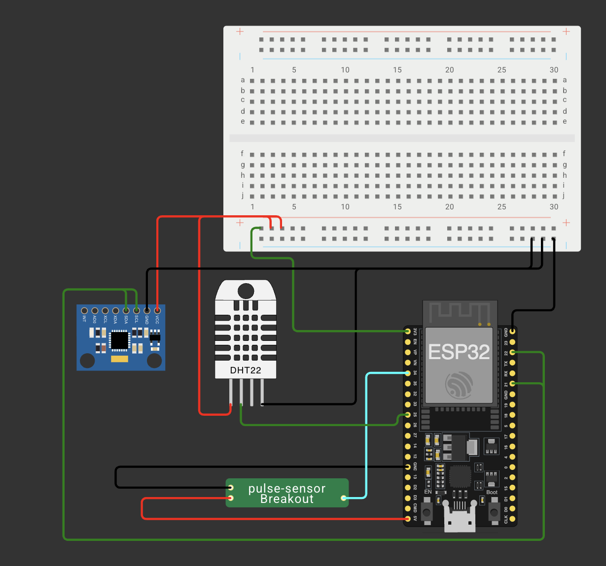
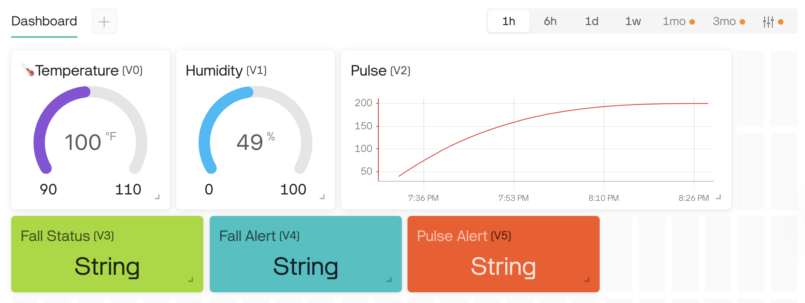

# Elderly Health Monitoring System

A compact and efficient health monitoring system for elderly individuals using ESP32 and IoT. It monitors **pulse rate**, **body temperature**, and **fall detection**, and alerts are displayed on an LCD as well as remotely via the **Blynk IoT app**.

---

## Components Used

* ESP32 DevKit V4
* Pulse Sensor (custom chip in Wokwi)
* DHT22 Temperature & Humidity Sensor
* MPU6050 Accelerometer
* Blynk IoT Dashboard

---

## Circuit Diagram



* **Pulse Sensor** connected to `GPIO 36 (VP)`
* **DHT22**:

  * VCC to `3.3V`
  * GND to `GND`
  * Data to `GPIO 15`
* **MPU6050**:

  * VCC to `3.3V`
  * GND to `GND`
  * SDA to `GPIO 21`
  * SCL to `GPIO 22`

---

## Functionality & Working

### 1. **Pulse Monitoring**

* The pulse sensor simulates analog pulse wave.
* ESP32 reads values from analog pin.
* Pulse rate is calculated based on pulse intervals.

### 2. **Temperature Monitoring**

* DHT22 gives digital readings for temperature.
* If temperature exceeds **100°F**, a **Fever Alert** is triggered.

### 3. **Fall Detection**

* MPU6050 provides acceleration values.
* Sudden high acceleration (> 1.5g) triggers a **Fall Alert**.

### 4. **Alert System**

* Alerts like `Fever Alert`, `Bradycardia`, or `Tachycardia`, and `Fall Detected` are shown on:

  * **LCD** display
  * **Blynk** mobile & web dashboard via Virtual Pins

---

## Blynk Integration




* **Dashboard Widgets**:

  * Temperature: V0 (Gauge)
  * Humidity: V1 (Gauge)
  * Pulse Rate: V2 (Live Graph)
  * Fall Status: V3 (Label)
  * Fall Alert: V4 (Label)
  * Pulse Alert: V5 (Label)

* **Template Info** (in Arduino code):

```cpp
#define BLYNK_TEMPLATE_ID "YourTemplateID"
#define BLYNK_TEMPLATE_NAME "Elderly Health Monitor"
#define BLYNK_AUTH_TOKEN "YourAuthToken"
```

* **How Data is Sent**:

```cpp
Blynk.virtualWrite(V0, temperature);
Blynk.virtualWrite(V2, pulse);
Blynk.virtualWrite(V4, "Fall Detected!");
```

---

## Simulating on Wokwi

* ESP32 will read data from simulated sensors.
* LCD will show real-time vitals and alerts.
* Serial Monitor will simulate Blynk updates (as Wokwi doesn’t support Internet).

---

## Deploying on Real Hardware

* Upload the code to ESP32 via Arduino IDE.
* Ensure Wi-Fi credentials are correctly set.
* Use the Blynk mobile app to monitor real-time data.

---

## Conclusion

This system provides a **reliable, real-time health monitoring solution** for elderly individuals. It combines local display with remote monitoring and alerts, offering both independence and safety.

---
