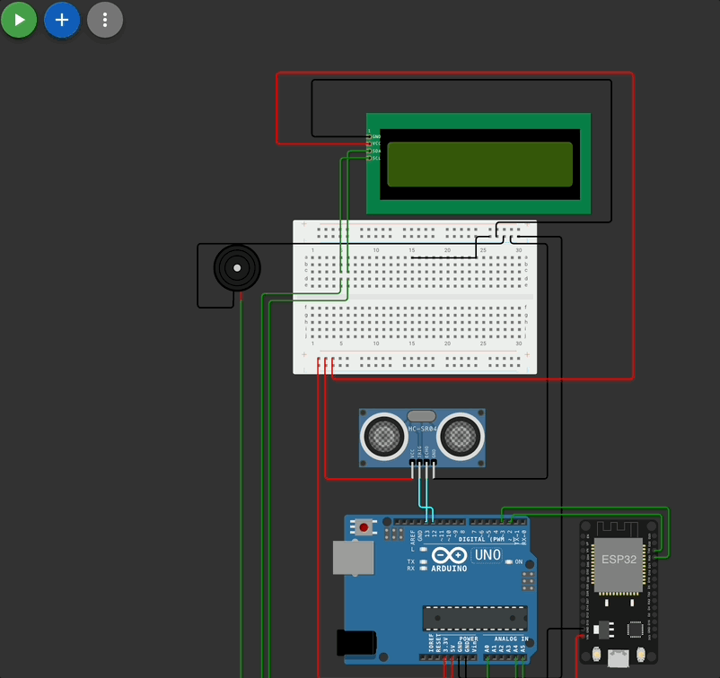
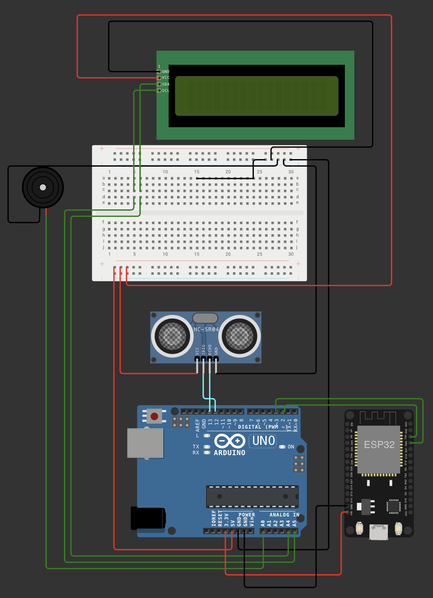
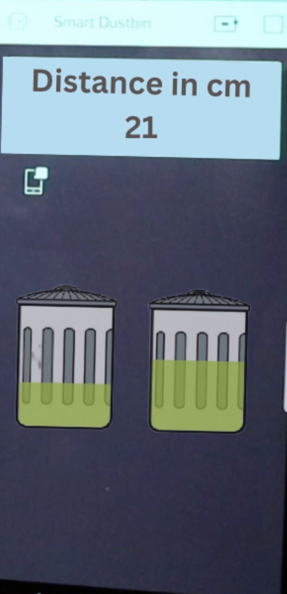

# IoT-Based Smart Monitoring using Arduino UNO + ESP8266

This project demonstrates how to send real-time sensor data of garbage level from an **Arduino Uno** to the **Blynk mobile app** using an **ESP8266 (ESP-01)** module. It’s part of the **RISE Internship 2025 IoT Projects**.

---

## Project Demo GIF

---

## Circuit Diagram

> Make sure to use a **3.3V regulator** like **AMS1117** for powering the ESP8266, and a **voltage divider** (e.g., 2kΩ/1kΩ) on the TX pin of the Arduino to protect the RX pin of the ESP.

---

## Blynk App Dashboard

---

## How It Works

1. **Arduino Uno** reads data from a sensor (e.g., ultrasonic for level detection).
2. Sends this data via **SoftwareSerial** to the **ESP8266** module.
3. **ESP8266** is preloaded with a sketch that:
   - Connects to Wi-Fi
   - Parses incoming serial data
   - Sends it to the **Blynk Cloud**
4. **Blynk mobile app** displays the sensor data on a real-time dashboard.

---

## Hardware Components

| Component       | Quantity | Description                       |
|----------------|----------|------------------------------------|
| Arduino Uno     | 1        | Microcontroller                   |
| ESP8266 ESP-01  | 1        | Wi-Fi Module                      |
| Ultrasonic Sensor| 1       | Sensor depending on use case      |
| Jumper Wires    | 10+      | For connections                   |
| Breadboard      | 1        | For prototyping                   |
| LCD 16x2 (I2C) Screen      | 1        | To indicate the level of the garbage    |
| Buzzer          | 1        | For additional alarm              |   

---

## Pin Connections

### ESP8266 ↔ Arduino Uno

| ESP8266 Pin | Arduino Uno Pin     |
|-------------|----------------------|
| VCC         | 3.3V (via AMS1117)   |
| GND         | GND                  |
| CH_PD       | 3.3V                 |
| TX          | D2 (SoftwareSerial RX) |
| RX          | D3 (TX via divider)  |

---

## Features

- Real-time monitoring via mobile along with the LCD screen
- Modular codebase: separate Uno and ESP logic
- Works with different sensor types
- Wi-Fi enabled via ESP-01
- Mobile alerts via Blynk if thresholds exceeded

---

## Future Improvements

- Replace ESP-01 with **NodeMCU** or **ESP32** for simplicity
- Add more sensors (smoke, flame, gas)
- Push notifications or email alerts
- Cloud logging (e.g., Google Sheets or Firebase)
